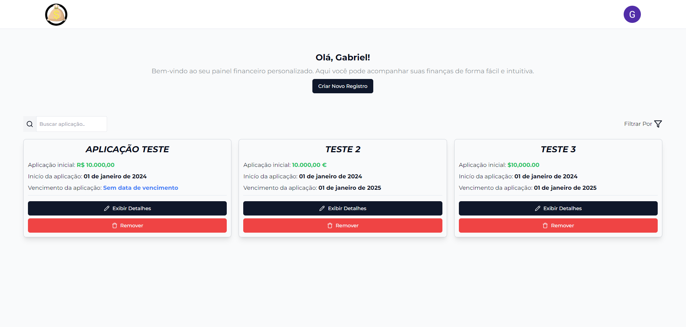
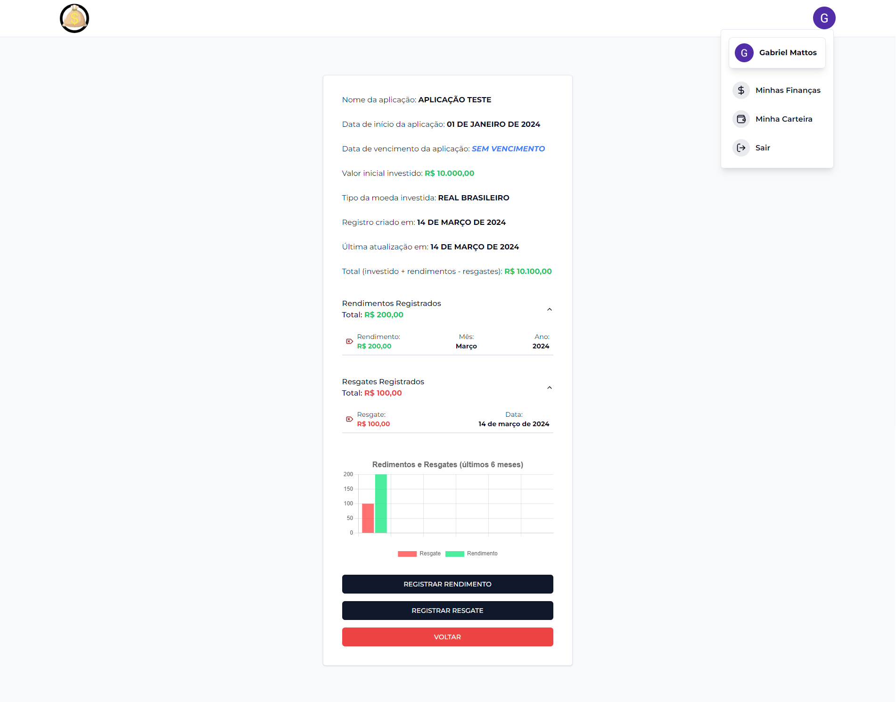
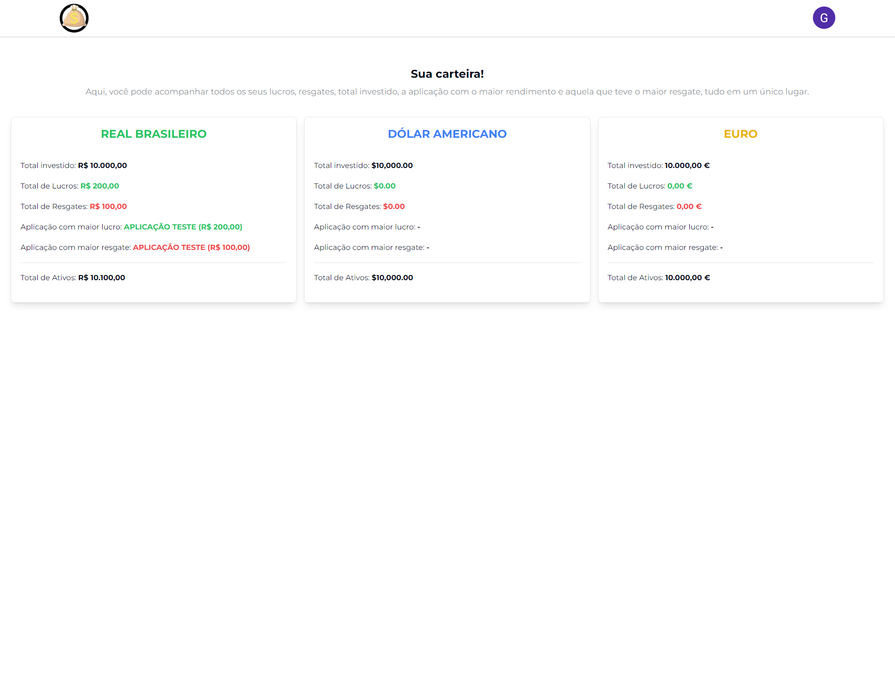

# Gerenciador de Finanças 💻

O Gerenciador de Finanças é uma aplicação desenvolvida para ajudar os usuários a controlar e monitorar suas finanças de maneira simples e eficaz. Com este aplicativo, os usuários podem cadastrar suas aplicações financeiras em um único lugar, registrar lucros e resgates mensais, e visualizar informações detalhadas sobre suas carteiras de investimento.

## Problema Resolvido 💡

Muitas vezes, os usuários têm diversas aplicações financeiras distribuídas em diferentes locais, como bancos, corretoras ou investimentos em diferentes moedas. O Gerenciador de Finanças resolve esse problema ao permitir que os usuários centralizem todas as suas aplicações financeiras em um único lugar, facilitando o acompanhamento e a gestão de suas finanças.

## Funcionalidades Principais 📝

- Cadastro de diversas aplicações financeiras, incluindo nome, data de início, data de vencimento (opcional), tipo de moeda (Real, Euro ou Dólar) e valor inicial aplicado.
- Registro de lucros e resgates mensais para cada aplicação.
- Visualização detalhada de cada aplicação, incluindo informações como total investido, total de lucros, total de resgates, entre outros.
- Geração de gráficos para visualizar os últimos 6 meses de lucros e resgates.
- Autenticação de usuário via Google utilizando a biblioteca `next-auth`.
- Interface amigável e responsiva para facilitar a utilização em diferentes dispositivos.
- Pesquisa e filtragem: Os usuários podem pesquisar por uma aplicação específica ou filtrar as aplicações com base em critérios como nome, tipo de moeda, data de início, etc.

## Como Utilizar 📖

1. Faça login com sua conta do Google.
2. Adicione suas aplicações financeiras na página principal, preenchendo os detalhes necessários.
3. Registre seus lucros e resgates mensais para cada aplicação.
4. Visualize informações detalhadas sobre suas aplicações e carteiras de investimento.

## Tecnologias Utilizadas 🚀

- [React](https://react.dev/): Biblioteca JavaScript para construção de interfaces de usuário.
- [Next.js](https://nextjs.org/): Framework React para construção de aplicações web que oferece renderização do lado do servidor (SSR), geração estática (SSG), entre muitos outros recursos.
- [Next-auth](https://next-auth.js.org/): Biblioteca para autenticação de usuários com suporte ao OAuth.
- [Prisma](https://www.prisma.io/): ORM (Object-Relational Mapping) para acesso ao banco de dados.
- [Supabase](https://supabase.com/): Plataforma de banco de dados e autenticação.
- [Lucide React Icons](https://lucide.dev/): Biblioteca de ícones para React.
- [React Toastify](https://www.npmjs.com/package/react-toastify): Componente para exibição de notificações.
- [Tailwind CSS](https://tailwindcss.com/): Framework CSS para estilização que oferece várias classes para utilização já pré-estilizadas.
- [TypeScript](https://www.typescriptlang.org/): Linguagem de programação.
- [Shadcn](https://ui.shadcn.com/): Biblioteca UI de componentes reutilizáveis.
- [Date-fns](https://date-fns.org/): Biblioteca para manipulação de datas.
- [Chart.js](https://www.chartjs.org/): Biblioteca para criação de gráficos.

## Instalação ⚙️

Para utilizar o Gerenciador de Finanças localmente, siga estas etapas:

1. Clone este repositório.
2. Instale as dependências utilizando `npm install`.
3. Configure suas variáveis de ambiente conforme necessário.
4. Execute o aplicativo utilizando `npm run dev`.

## Deploy na Vercel 💻☁️

Este projeto está atualmente disponível online através da Vercel. Você pode acessá-lo [aqui](https://finance-manager-gamma.vercel.app/). Experimente a aplicação em tempo real!

## Imagens Relevantes 🖼️

### Página Inicial

Visão geral da página inicial do Gerenciador de Finanças, onde os usuários podem adicionar novas aplicações financeiras e visualizar suas finanças registradas.

### Detalhes da Aplicação Financeira

Exibição detalhada de uma aplicação financeira, incluindo informações como nome, data de início, tipo de moeda, total investido e gráficos de lucros e resgates mensais.

### Página "Minha Carteira"

Visualização da página "Minha Carteira" no Gerenciador de Finanças, onde os usuários podem acessar informações detalhadas sobre suas carteiras financeiras, incluindo o total investido, total de lucros, total de resgates, a aplicação com o maior lucro, a aplicação com o maior resgate e o total de ativos para cada tipo de moeda (Real, Euro e Dólar), conforme descrito anteriormente.

